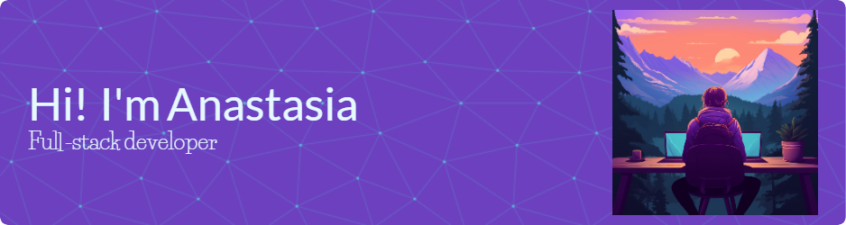

<div></div>

## 💫 About Me:
🔭 I’m currently working on: building my portfolio<br>
🌱 I’m currently learning: Postman, Postgress, React<br>
💡 Curious about learning: Netlify, Vercel, more about Web Accessibility<br>
👯 I’m looking to collaborate on: creating new projects<br>
💬 Ask me about: JavaScript, new project ideas<br>
🌐 How to reach me:
    [](mailto:anastasiaadamoudi@gmail.com)
    [](https://linkedin.com/in/anastasiaadamoudi89)
    [](https://instagram.com/anastasia.ad.m31)<br>
⚡ Fun fact: I love cats!

```javascript
let more_about_anastasia = {
  education: {  degree_title: "Bsc Mathematics",
                university_name: "University of Ioannina"  },
  work_experience: [  "School of Code",
  		      "domiciliary care",
                      "mathematics private tutor",
                      "seasonal customer service",
                      "volunteer walking route designer, group coordinator and tour guide"  ],
  skills_gained: [  "teamwork",
                    "user centred approach",
                    "adaptability"  ],
  characteristics: [  "creativity",
                      "organisation",
                      "analytical mind"  ]
}
```

## 💻 Tech Stack:

Web Development: 

<p>
	


	
</p>

Testing:

<p>
	


	
</p>

Project & Design: 

<p>
	


	
</p>

<details>
    <summary>
        <h2> :open_file_folder: My Repositories </h2>
    </summary>
    <div>
        <p align="right">
	        <a href="https://github.com/AnastasiaAdamoudi/SchoolOfCode-Mid-Course-Team-Frontend-Project.git">
      		  
            </a>
        </p>
    </div>
 </details>


<details>
  <summary>
    <h2> 📊 GitHub Stats </h2>
  </summary>
    
  <br/>
  <br/>
  <br/>
  
    
</details>

<details>
  <summary>
    <h2> :trophy: GitHub Trophies </h2>
  </summary>
  <a href="https://github.com/ryo-ma/github-profile-trophy"></a>
</details>

## ✍️ Random Dev Quote


